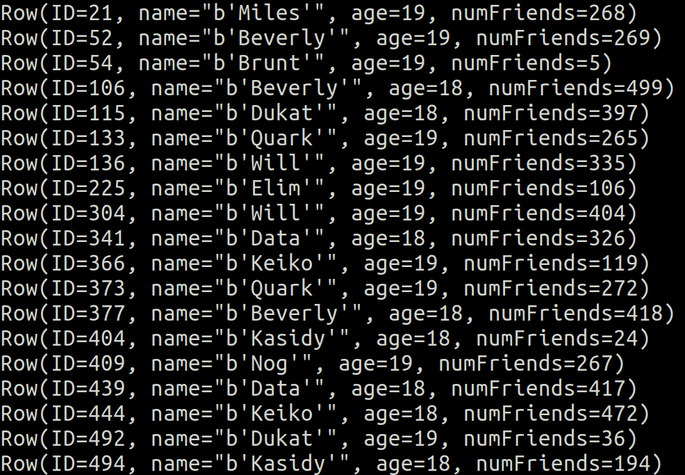
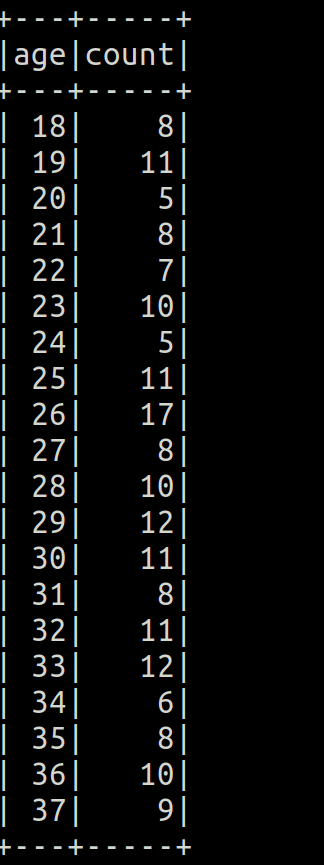
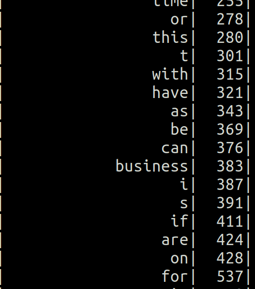
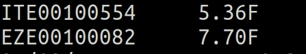

# 3- SparkSQL-DataFrames-and-DataSets

1. [Introducción a spark-SQL](#schema1)
2. [Usando las funciones de SQL](#schema2)
3. [SprakSession.read y withColumn()](#schema3)

# 1. Introducción a spark-SQL
*   DataFrames and Datasets
    - Contiene fila de objetos
    - Puede hacer queries a SQL
    - Puedes tener esquemas
    - Lee y escribe en JSON, ..
    - Comunición JDBC/ ODBC, Tableau

1º Importamos las librerías para poder trabajar con los DataFrame
~~~ python
from pyspark.sql import SparkSession
from pyspark.sql import Row
~~~

2º Creamos una session SparkSession
~~~ Python
spark = SparkSession.builder.appName("SparkSQL").getOrCreate()
~~~
3º Definimos una función que va a convertir los datos en filas
~~~ python
def mapper(line):
    fields = line.split(',')
    return Row(ID=int(fields[0]), name=str(fields[1].encode("utf-8")), age=int(fields[2]), numFriends=int(fields[3]))
~~~
4º Cargamos lo datos, creamos RDD y las mapeamos con la función.
~~~ python

lines = spark.sparkContext.textFile("./data/fakefriends.csv")
people = lines.map(mapper)
~~~

5º Definimos  el esquema y registre el DataFrame como una tabla.
~~~python
schemaPeople = spark.createDataFrame(people).cache()
schemaPeople.createOrReplaceTempView("people")
~~~
6º Hacemos las queries e imprimimos los resultados
~~~ python
teenagers = spark.sql("SELECT * FROM people WHERE age >= 13 AND age <= 19")

for teen in teenagers.collect():
  print(teen)
~~~
7º También podemos hacer instacias de SQL queries
~~~ python
 schemaPeople.groupBy("age").count().orderBy("age").show()
~~~

8º Cerramos sesión
~~~ python 
spark.stop()
~~~

9º Ejercicio media de amigos por edad.
~~~ python
# Select only age and numFriends columns
friendsByAge = people.select("age", "friends")

# From friendsByAge we group by "age" and then compute average
friendsByAge.groupBy("age").avg("friends").show()

#Sorted 
friendsByAge.groupBy("age").avg("friends").sort("age").show()

# With a custom column name
friendsByAge.groupBy("age").agg(func.round(func.avg("friends"), 2)
  .alias("friends_avg")).sort("age").show()

~~~

# 2. Usando las funciones de SQL.
Se usan para dataframes.

* func.explode => Muy parecida a flatmap
* func.split => Parecida a split
* func.lower => Parecida a lower

1º Importamos las librerías
~~~ python
from pyspark.sql import SparkSession
from pyspark.sql import functions as func
~~~
2º Creamos la conexión y cargamos los datos
~~~python
spark = SparkSession.builder.appName("WordCount").getOrCreate()

# Read each line of my book into a dataframe
inputDF = spark.read.text("./data/book.txt")
~~~
3º Dividimos usando una expresión regular que extrae palabras

~~~ python
words = inputDF.select(func.explode(func.split(inputDF.value, "\\W+")).alias("word"))
words.filter(words.word != "")
~~~
4º Las ponemos todas en minsúculas
~~~ python
lowercaseWords = words.select(func.lower(words.word).alias("word"))
~~~
5º Contamos cuantas aparaciones de cada palabra, las ordenamos e imprimimos por pantalla
~~~ python
wordCounts = lowercaseWords.groupBy("word").count()
wordCountsSorted = wordCounts.sort("count")
wordCountsSorted.show(wordCountsSorted.count())
~~~

# 3. SprakSession.read y withColumn()
1º Importamos liberías y creamos la conexión.

~~~python
from pyspark.sql import SparkSession
from pyspark.sql import functions as func
from pyspark.sql.types import StructType, StructField, StringType, IntegerType, FloatType

spark = SparkSession.builder.appName("MinTemperatures").getOrCreate()
~~~
2º Creamos el esquema que le vamos a dar  al dataframe
~~~python
schema = StructType([ \
                     StructField("stationID", StringType(), True), \
                     StructField("date", IntegerType(), True), \
                     StructField("measure_type", StringType(), True), \
                     StructField("temperature", FloatType(), True)])
~~~
3º Aplicamos a los datos leído el esquema que creamos anteriomente
~~~python

df = spark.read.schema(schema).csv("./data/1800.csv")
df.printSchema()
~~~
4º Filtramos por `TMIN` y seleccionamos solo las columnas `stationID`y `temperature`
~~~python

minTemps = df.filter(df.measure_type == "TMIN")

stationTemps = minTemps.select("stationID", "temperature")
~~~
5º Hacemos un agrupamiento por `stationID`y obtenemos la temperatura mínima
~~~Python

minTempsByStation = stationTemps.groupBy("stationID").min("temperature")
minTempsByStation.show()
~~~
6º Comvertimos la temperatura a fahrenheit y las ordenamos
~~~python
# Convert temperature to fahrenheit and sort the dataset
minTempsByStationF = minTempsByStation.withColumn("temperature",
                                                  func.round(func.col("min(temperature)") * 0.1 * (9.0 / 5.0) + 32.0, 2))\
                                                  .select("stationID", "temperature").sort("temperature")
~~~
7º Imprimimos los resultado y cerramos la conexión
~~~Python                                                  
# Collect, format, and print the results
results = minTempsByStationF.collect()

for result in results:
    print(result[0] + "\t{:.2f}F".format(result[1]))
    
spark.stop()

~~~

